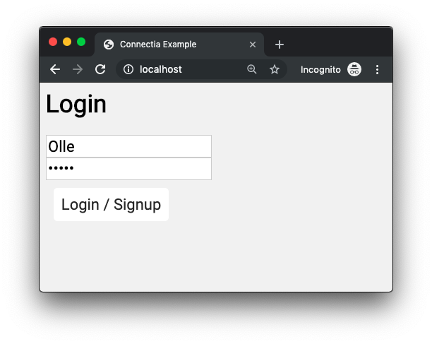
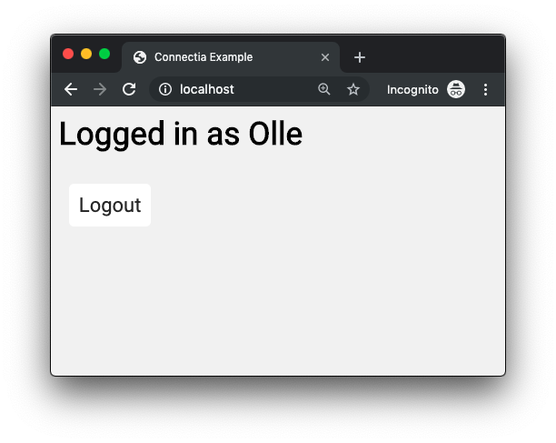

# Connectia Login Example

This example demonstrates how you can use Connectia for ajax, and also authenticate the user through a cookie via the request.

You can always grab the express app from Connectia and modify it.

Install all dependencies
    
    $ npm install connectia file-system md5 cookie-parser pug

Project structure

    - public
        static files, js and css
    - views
        pug files
    index.js    | Server javascript
    users.json  | User data

